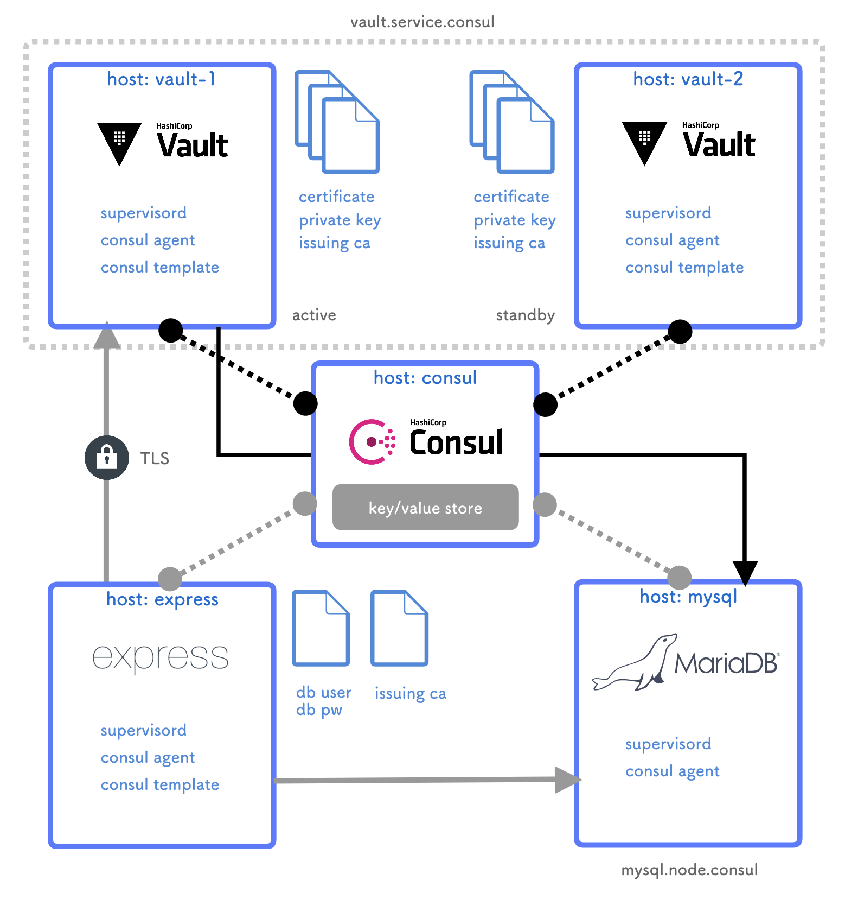

Vault Workshop
==============

This repository for Hashicorp Vault Workshop.

docker-compose not using workshop [here](https://gist.github.com/linyows/64be55af49031b995c3de9161c9c6713).

Requirement
--

- docker >= 18.06.0-ce
- docker-compose >= 1.22.0
- homebrew >= 1.7.3

Architecture
--

In this workshop, we will build the following system.



Setup
--

```sh
$ brew install consul vault
$ vault -autocomplete-install

$ docker-compose build
$ docker-compose up -d

$ export CONSUL_HTTP_ADDR=localhost:8500
$ export VAULT_SKIP_VERIFY=true
$ export VAULT_ADDR=https://localhost:8200
```

Init & Unseal
--

```sh
$ consul members
Node          Address          Status  Type    Build  Protocol  DC   Segment
consul        172.17.0.2:8301  alive   server  1.2.0  2         dc1  <all>
daab3150c77f  172.17.0.5:8301  alive   client  1.2.0  2         dc1  <default>
express       172.17.0.4:8301  alive   client  1.2.0  2         dc1  <default>
mysql         172.17.0.3:8301  alive   client  1.2.0  2         dc1  <default>

$ vault operator init | tee vault-keys
Unseal Key 1: D6r52Rz8lGKTJNzA7V53LQLrxgS5FGPOi9vZiYkQr5tg
Unseal Key 2: oup3PiWVF1YTtnN1tNpUzu2fxX7awwYhWL6ZGvvkiUVq
Unseal Key 3: 5Mtas7m1wyX6Q9JVTefN9WPPhFJyabWXklWuHGJfyk0k
Unseal Key 4: AowN0pbneXVArmHB7YtKkUkgCGEz6qPo0D17DPXy8jNy
Unseal Key 5: OjWFrQI3oGOlhsFHOCp4pXxRveoS4ERt+7sR9Y+4lEhD

Initial Root Token: c6ba348a-053f-00f9-9066-69da5b1cb23f

Vault initialized with 5 key shares and a key threshold of 3. Please securely
distribute the key shares printed above. When the Vault is re-sealed,
restarted, or stopped, you must supply at least 3 of these keys to unseal it
before it can start servicing requests.

Vault does not store the generated master key. Without at least 3 key to
reconstruct the master key, Vault will remain permanently sealed!

It is possible to generate new unseal keys, provided you have a quorum of
existing unseal keys shares. See "vault rekey" for more information.

# Repeat unseal until the threshold is exceeded
$ vault operator unseal

$ vaullt login
Token (will be hidden):
Success! You are now authenticated. The token information displayed below
is already stored in the token helper. You do NOT need to run "vault login"
again. Future Vault requests will automatically use this token.

Key                Value
---                -----
token              c6ba348a-053f-00f9-9066-69da5b1cb23f
token_accessor     56024b80-3589-70d5-f128-0b0a4420e2b8
token_duration     ∞
token_renewable    false
token_policies     [root]
```

Vault HA
--

```sh
$ docker-compose up -d --scale vault=2
Starting vault-workshop_vault_1 ... done
Creating vault-workshop_vault_2 ... done

$ consul members
Node          Address          Status  Type    Build  Protocol  DC   Segment
consul        172.17.0.2:8301  alive   server  1.2.0  2         dc1  <all>
9d0c64857521  172.17.0.6:8301  alive   client  1.2.0  2         dc1  <default>
daab3150c77f  172.17.0.5:8301  alive   client  1.2.0  2         dc1  <default>
express       172.17.0.4:8301  alive   client  1.2.0  2         dc1  <default>
mysql         172.17.0.3:8301  alive   client  1.2.0  2         dc1  <default>

# Switch to standby
$ export VAULT_ADDR=https://localhost:8201

# Repeat unseal until the threshold is exceeded
$ vault operator unseal
Unseal Key (will be hidden):
Key                    Value
---                    -----
Seal Type              shamir
Sealed                 false
Total Shares           5
Threshold              3
Version                0.11.0
Cluster Name           vault-cluster-6f89fa19
Cluster ID             283c4fa3-7523-bebc-69e9-627f664bc289
HA Enabled             true
HA Cluster             https://vault.service.consul:8201
HA Mode                standby
Active Node Address    https://vault.service.consul:8200

# Switch to master
$ export VAULT_ADDR=https://localhost:8200

$ vault status
Key             Value
---             -----
Seal Type       shamir
Sealed          false
Total Shares    5
Threshold       3
Version         0.11.0
Cluster Name    vault-cluster-6f89fa19
Cluster ID      283c4fa3-7523-bebc-69e9-627f664bc289
HA Enabled      true
HA Cluster      https://vault.service.consul:8201
HA Mode         active
```

Audit Device
--

```sh
$ vault audit enable file file_path=/var/log/vault_audit.log
Success! Enabled the file audit device at: file/
```

PKI Secrets
--

```sh
$ vault secrets enable -max-lease-ttl=87600h -description="root ca" pki
Success! Enabled the pki secrets engine at: pki/

$ vault write pki/root/generate/internal common_name=service.consul ttl=8760h
...

$ vault write pki/config/urls issuing_certificates="https://vault.service.consul:8200/v1/pki/ca" \
  crl_distribution_points="https://vault.service.consul:8200/v1/pki/crl"
Success! Data written to: pki/config/urls

$ vault write pki/roles/service-dot-consul allowed_domains=service.consul allow_subdomains=true max_ttl=72h
Success! Data written to: pki/roles/service-dot-consul
```

Consul Template
--

```sh
$ docker exec -it vault-workshop_vault_1 curl https://vault.service.consul:8200/v1/
curl: (6) Could not resolve host: vault.service.consul

$ docker exec -it vault-workshop_vault_1 supervisorctl status
consul                           RUNNING   pid 11, uptime 0:06:04
consul-template                  STOPPED   Not started
vault                            RUNNING   pid 10, uptime 0:06:04

$ docker exec -it vault-workshop_vault_1 vault login
Token (will be hidden):
Success! You are now authenticated. The token information displayed below
is already stored in the token helper. You do NOT need to run "vault login"
again. Future Vault requests will automatically use this token.

Key                Value
---                -----
token              c6ba348a-053f-00f9-9066-69da5b1cb23f
token_accessor     56024b80-3589-70d5-f128-0b0a4420e2b8
token_duration     ∞
token_renewable    false
token_policies     [root]

$ docker exec -it vault-workshop_vault_1 supervisorctl start consul-template
consul-template: started

$ docker exec -it vault-workshop_vault_1 curl https://vault.service.consul:8200/v1/
{"errors":[]}
```

Database Secrets
--

```sh
$ vault secrets enable -description "mysql database" database
Success! Enabled the database secrets engine at: database/

$ vault write database/config/mysql-database plugin_name=mysql-database-plugin \
  connection_url="{{username}}:{{password}}@tcp(mysql.node.consul:3306)/" \
  allowed_roles="express" username="root" password="secret"

$ vault write database/roles/express db_name=mysql-database default_ttl="1h" max_ttl="24h" \
  creation_statements="CREATE USER '{{name}}'@'%' IDENTIFIED BY '{{password}}';GRANT ALL ON *.* TO '{{name}}'@'%';"
Success! Data written to: database/roles/express

$ vault read database/creds/express
Key                Value
---                -----
lease_id           database/creds/express/2e23298a-7527-4297-abe0-f34d65619731
lease_duration     1h
lease_renewable    true
password           A1a-l3iPUojCAbapJRJP
username           v-root-express-3vNkDojhqaKs6uRyw

# login test
$ mysql -h 127.0.0.1 -P 13306 -u v-root-express-3vNkDojhqaKs6uRyw -p
Enter password:
Welcome to the MySQL monitor.  Commands end with ; or \g.
Your MySQL connection id is 6
Server version: 5.5.5-10.1.32-MariaDB MariaDB Server

Copyright (c) 2000, 2018, Oracle and/or its affiliates. All rights reserved.

Oracle is a registered trademark of Oracle Corporation and/or its
affiliates. Other names may be trademarks of their respective
owners.

Type 'help;' or '\h' for help. Type '\c' to clear the current input statement.

mysql>
```

Transit Secrets
--

```sh
$ vault secrets enable -description "express transit" transit
Success! Enabled the transit secrets engine at: transit/

$ vault write -f transit/keys/express_users_email convergent_encryption=true derived=true
Success! Data written to: transit/keys/express_users_email

$ docker exec -it vault-workshop_express_1 /bin/bash -c 'echo -n c6ba348a-053f-00f9-9066-69da5b1cb23f > /root/.vault-token'

$ docker exec -it vault-workshop_express_1 supervisorctl start consul-template
consul-template: started

$ docker exec -it vault-workshop_express_1 cat .env
DB_USER='v-root-express-1KCQx0dw5HTYGH039'
DB_PASS='A1a-3Ilm5XgWx3OyMlff'

$ docker exec -it vault-workshop_express_1 supervisorctl start express
express: started

# save email
$ open http://localhost:3000/

# check database
mysql -u root -h localhost -P 13306 -p express
> select * from users;
+----+----------+-----------------------------------------------------------------------+---------------------+---------------------+
| id | username | email_encrypted                                                       | created_at          | updated_at          |
+----+----------+-----------------------------------------------------------------------+---------------------+---------------------+
|  1 | foo      | vault:v1:KH3EjZ+ImLS84QprzzGWizI6rpEYZ8KCfl5i5iP9x2c1/i92sPSoTa3ZXG4= | 2018-09-05 08:17:31 | 2018-09-05 08:17:31 |
|  2 | foo2     | vault:v1:KH3EjZ+ImLS84QprzzGWizI6rpEYZ8KCfl5i5iP9x2c1/i92sPSoTa3ZXG4= | 2018-09-05 08:18:25 | 2018-09-05 08:18:25 |
|  3 | bar      | vault:v1:J8N8lHzTxwm0RlPQ/YRjTTpwNMNMiSbxUovElfccn3ZEjkwnAVIUHEiG7l4= | 2018-09-05 08:18:36 | 2018-09-05 08:18:36 |
+----+----------+-----------------------------------------------------------------------+---------------------+---------------------+
3 rows in set (0.00 sec)

# check by API
$ echo -n 'express' | openssl enc -e -base64
ZXhwcmVzcw==

$ vault write transit/decrypt/express_users_email \
    ciphertext=vault:v1:KH3EjZ+ImLS84QprzzGWizI6rpEYZ8KCfl5i5iP9x2c1/i92sPSoTa3ZXG4= \
    context=ZXhwcmVzcw==
Key          Value
---          -----
plaintext    Zm9vQGV4YW1wbGUudGVzdA==

$ echo 'Zm9vQGV4YW1wbGUudGVzdA==' | openssl enc -d -base64
foo@example.test
```

GitHub Auth
--

```sh
$ vault auth enable github
Success! Enabled github auth method at: github/

$ vault write auth/github/config organization=your-org
Success! Data written to: auth/github/config
# if github enterprise
# $ vault write auth/github/config organization=your-org base_url=https://ghe.yourdomain.com/api/v3/

$ vault read sys/policy
Key         Value
---         -----
keys        [default root]
policies    [default root]

$ docker exec -it vault-workshop_vault_1 cat /etc/vault.d/dev.hcl > dev.hcl
$ vault policy write dev dev.hcl
Success! Uploaded policy: dev

$ vault read sys/policy
Key         Value
---         -----
keys        [default dev root]
policies    [default dev root]

$ vault write auth/github/map/teams/dev value=dev
Success! Data written to: auth/github/map/teams/dev

# create github token (require admin:org)
$ open https://github.com/settings/tokens

# login by github token
$ open https://localhost:8200/ui/
```

Audit Log
--

```sh
$ docker exec -it vault-workshop_vault_1 less /var/log/vault_audit.log
```

Author
--

- [linyows](https://github.com/linyows)

Thanks
--

Thank you [HashiCorp](https://www.hashicorp.com/) for great software including Vault and Consul.
